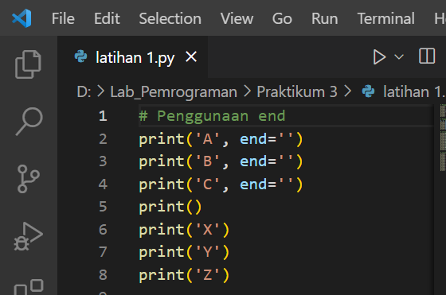
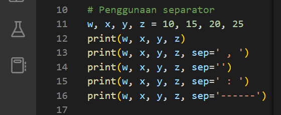
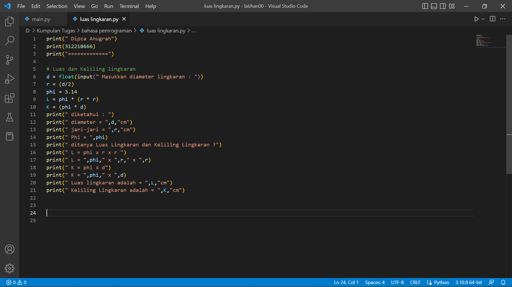

#Praktikum 3
# **latihan 1**
1. Parameter end
Parameter end berfungsi untuk mengganti karakter terakhir bawaan yang dicetak di layar. Jadi secara bawaan, setiap kali kita memanggil fungsi print() untuk mencetak sesuatu, python akan mencetak karakter ganti baris ( ) di setiap output.

2. Separator
sep adalah pemisah(separator) yang berfungsi sebagai tanda pemisah antar objek yang dicetak. Defaultnya adalah tanda spasi.

3. String format
Fungsi format() berfungsi untuk melakukan pengaturan format string yang akan dicetak atau ditampilkan ke monitor.

# **latihan 2**
1. input dan output variabel a dan b 
- format hasil penggabungan 
- format hasil penjumlahan 
- format hasil pembagian

# **latihan 3**

# **Menghitung Luas dan Keliling Lingkaran**
1. Luas Lingkaran dan Keliling Lingkaran
- Input diameter(d), jari-jari(r), phi, L dan K
- Menghitung L = phi * (r*r)
- Menghitung K = phi * d
- output Luas Lingkaran dan Keliling Lingkaran(print L dan K)

